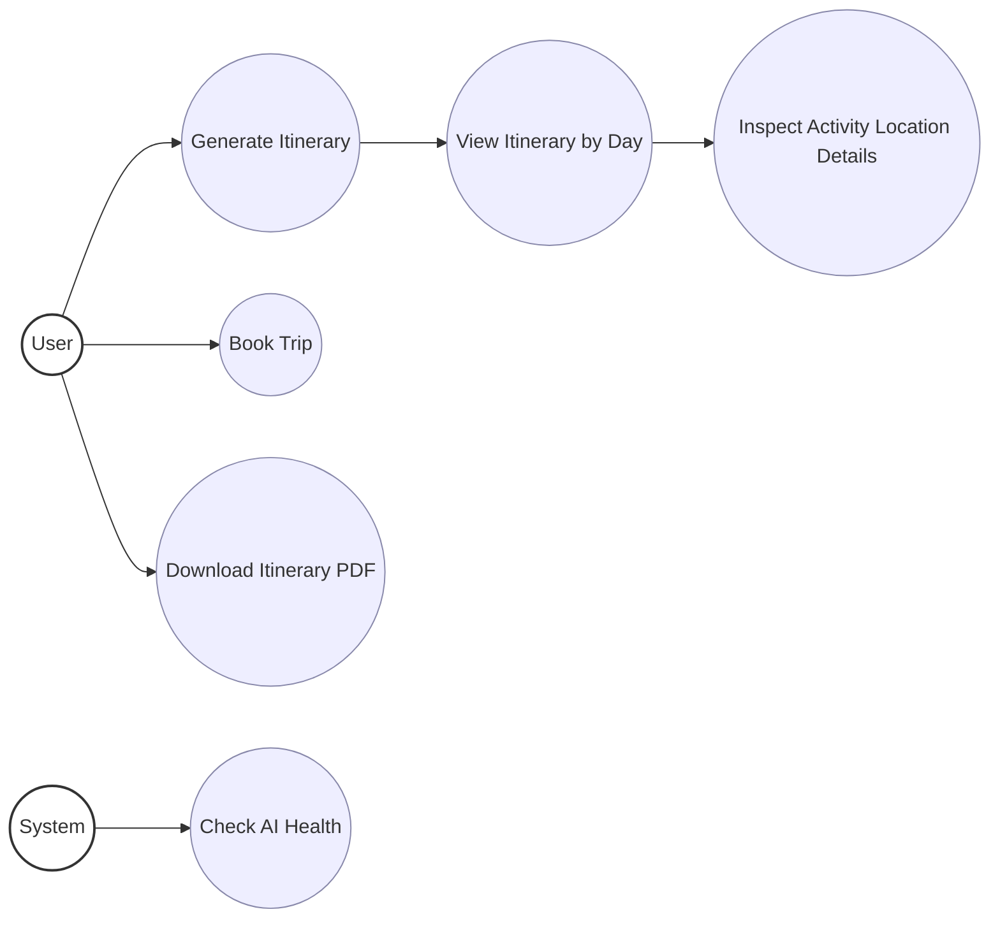
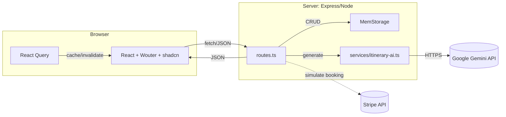

# Travel Itinerary Application - System Diagrams

This document contains visual diagrams that illustrate the architecture, user flows, and use cases of the AI-powered travel itinerary application.

## 1. Process Flow Diagram

This diagram shows the complete user journey from landing page to booking confirmation:

```mermaid
flowchart TD
  A[Landing Page] --> B[Get Started]
  B --> C[Trip Preferences Form]
  C -->|POST /api/trips/generate| D[Express routes.ts]
  D --> E[Zod validate]
  E --> F[storage.createTrip]
  F --> G[services/itinerary-ai → Gemini]
  G --> H[storage.updateTripItinerary]
  H --> I{Response: tripId + itinerary}
  I --> J[ItineraryDisplay]
  J --> K[Open BookingModal]
  K --> L{Enter payment info}
  L -->|POST /api/trips/:id/book| M[Express routes.ts]
  M --> N[storage.getTrip]
  M -. simulate .-> O[Stripe]
  M --> P[storage.markTripAsBooked]
  P --> Q[Booking Confirmation]
  J --> R[Download PDF (stub)]
```

**Key Flow Steps:**
1. User lands on the homepage and clicks "Get Started"
2. User fills out trip preferences (destination, budget, duration, group size, interests, dates)
3. System validates input and creates a trip record
4. AI service (Gemini) generates personalized itinerary
5. User views generated itinerary with enhanced location display
6. User can click locations to open Google Maps
7. User can book the trip through payment processing
8. System confirms booking and updates trip status

## 2. Use Case Diagram

This diagram illustrates different user scenarios and system interactions:



**Use Cases:**
- **Generate Itinerary**: Create AI-powered travel plans based on user preferences
- **View Itinerary by Day**: Browse detailed daily schedules with activities, costs, and timings
- **Inspect Activity Location Details**: Click on locations to open Google Maps for navigation
- **Book Trip**: Process payments and confirm travel bookings
- **Download Itinerary PDF**: Export itinerary for offline access
- **Check AI Health**: System monitoring of AI service availability

## 3. Architecture Diagram

This diagram displays system components, data flow, and external integrations:



**Architecture Components:**

### Frontend (Browser)
- **React SPA**: Single Page Application built with React, Vite, and Wouter routing
- **shadcn UI**: Modern component library for consistent design
- **React Query**: State management for server data with caching and invalidation

### Backend (Server)
- **Express Routes**: RESTful API endpoints for trip management and payments
- **MemStorage**: In-memory data storage for trip and user data
- **AI Service**: Integration layer for Gemini AI itinerary generation

### External Integrations
- **Google Gemini API**: AI-powered itinerary generation using gemini-2.5-pro model
- **Stripe API**: Payment processing for trip bookings
- **Google Maps**: Location services for address navigation

### Key Features
- **Responsive Design**: Mobile-friendly interface with dark/light mode support
- **Real-time Updates**: Hot module replacement and live updates
- **Secure Payment**: Stripe integration with test/production key management
- **AI-Powered**: Personalized itineraries based on user preferences and Indian destinations
- **Interactive Locations**: Clickable locations that open Google Maps
- **Type Safety**: Shared TypeScript schemas between frontend and backend

## Technology Stack

**Frontend:**
- React 18 with TypeScript
- Vite for build tooling
- Wouter for client-side routing
- shadcn/ui + Tailwind CSS for styling
- React Query for state management
- React Hook Form for form handling

**Backend:**
- Node.js with Express
- TypeScript for type safety
- Zod for validation
- Drizzle ORM (with in-memory storage)
- Stripe for payments
- Google Gemini AI for itinerary generation

**Development:**
- Hot module replacement
- Environment variable management
- API key security through Replit Secrets
- Responsive design with mobile support